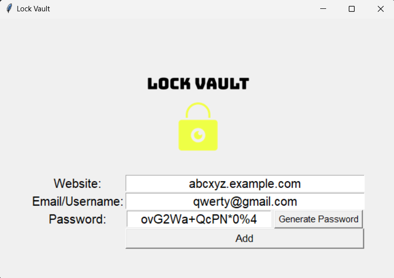

# 🔐 Lock Vault - A Simple Password Manager using Tkinter

**LockVault** is a secure, local password manager built using **Python** and **Tkinter**, designed to help you generate, manage, and store passwords efficiently. It provides a minimal yet elegant GUI, automatically copies passwords to your clipboard, and stores credentials in a simple `.txt` file on your machine.

---

## ✨ Features

-   🔐 **Secure password generation** using random combinations of letters, numbers, and symbols
-   💾 **Save credentials** (Website, Email/Username, Password) to a local text file
-   📋 **Copy passwords to clipboard** automatically after generation
-   📂 **Auto-create password file** if it doesn't exist
-   ✅ **User confirmation dialogs** before saving
-   🧠 **Simple, modern GUI** built using Tkinter
-   🖼️ **Resizable logo** handled with Pillow

---

## 🖥️ Preview



---

## 📁 File Structure

```
LockVault/
├── main.py                  # Main application file
├── logo-transparent.png     # Your app's logo (used in GUI)
├── .gitignore               # Ensures sensitive/cache files aren't uploaded
├── README.md                # Project documentation
└── password_information.txt # [Auto-created] Stores credentials locally
```

---

## 🔧 Requirements

This app is built using only standard Python libraries + [Pillow](https://pypi.org/project/Pillow/) for image resizing.

### ✅ Dependencies

-   Python 3.x
-   Tkinter (comes with Python)
-   Pillow (for image resizing)

### 📦 Install Pillow (if not installed)

```bash
pip install pillow
```

---

## 🚀 How to Run

1. **Clone the repository**

    ```bash
    git clone https://github.com/4M4ND3Y/lock-vault.git
    cd lockvault
    ```

2. **Install required module**

    ```bash
    pip install pillow
    ```

3. **Run the app**
    ```bash
    python main.py
    ```

> 📝 A `password_information.txt` file will be created automatically when you save credentials.

---

## 🛡️ Security Note

This app stores data in **plain text**, which is NOT recommended for real-world use.  
For improved security:

-   Use encryption with `cryptography` or `fernet`
-   Consider secure storage options like SQLite with encryption
-   Never upload your `password_information.txt` file to GitHub

---

## 💡 Possible Future Enhancements

-   🔐 Encrypt stored passwords
-   🔍 Search functionality for saved entries
-   🌙 Dark mode UI
-   📤 Export/import functionality
-   🧪 Unit tests and CI integration
-   🪟 Convert to executable (.exe) with PyInstaller

---

## 🤝 Contributing

Contributions are welcome! Here's how you can help:

1. Fork the repo
2. Create your feature branch: `git checkout -b feature/your-feature`
3. Commit your changes: `git commit -m 'Add feature'`
4. Push to the branch: `git push origin feature/your-feature`
5. Open a Pull Request

---

## 🙋‍♂️ Author

Made with ❤️ by **Aman Dey**

-   GitHub: [@4M4ND3Y](https://github.com/4M4ND3Y)
-   LinkedIn: [@amandey](https://linkedin.com/in/amandey)

---

## 📄 License

This project is licensed under the **MIT License** - feel free to use and modify.

---
